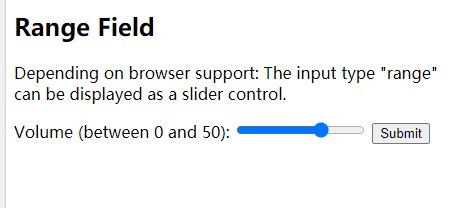
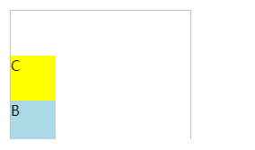

## Custom Video Player

Custom video player using the HTML5 video element and it's JavaScript API with a custom design

## Project Specifications

- Display custom video player styled with CSS
- Play/pause
- Stop
- Video progress bar
- Set progress bar time
- Display time in mins and seconds

## HTML
### link-integrity&crossorigin

两个属性一般在获取外部资源时使用

```html
<link href="https://maxcdn.bootstrapcdn.com/bootstrap/3.3.5/css/bootstrap.min.css" 
rel="stylesheet" 
integrity="sha256-MfvZlkHCEqatNoGiOXveE8FIwMzZg4W85qfrfIFBfYc= sha512-dTfge/zgoMYpP7QbHy4gWMEGsbsdZeCXz7irItjcC3sPUFtf0kuFbDz/ixG7ArTxmDjLXDmezHubeNikyKGVyQ==" 
crossorigin="anonymous">
```

integrity:
子资源完整性 (SRI) 是一项安全功能，可让浏览器验证其抓取的文件 (例如，从一个 CDN) 是在没有意外操作的情况下传递的。它的工作原理是允许您提供一个获取的文件必须匹配的加密散列/哈希。
允许浏览器检查文件源，以确保如果源已被操纵，则从不加载代码。

crossorigin:
该枚举属性指定在加载相关图片时是否必须使用CORS。可取的值包括以下两个：
- anonymous：会发起一个跨域请求（即包含Origin: HTTP头）。但不会发送任何认证信息（即不发送cookie, X.509证书和HTTP基本认证信息）。如果服务器没有给出源站凭证（不设置Access-Control-Allow-Origin: HTTP头），这张图片就会被污染并限制使用。
- use-credentials：会发起一个带有认证信息 (发送 cookie, X.509 证书和 HTTP 基本认证信息) 的跨域请求 (即包含 Origin: HTTP 头). 如果服务器没有给出源站凭证 (不设置 Access-Control-Allow-Origin: HTTP 头), 这张图片就会被污染并限制使用.
- 当不设置该属性时, 资源将会不使用 CORS 加载 (即不发送 Origin: HTTP 头), 这将阻止其在 元素中进行使用. 若设置了非法的值, 则视为使用 anonymous.

### video

```html
    <video
      src="videos/gone.mp4"
      id="video"
      class="screen"
      poster="img/poster.png"
    ></video>
```

### i
`<i>` 标签显示斜体文本效果。

### input-type:range
`<input type =“ range”>`定义了一个控件，用于输入其确切值不重要的数字（如滑块控件）。 默认范围是0到100。但是，您可以使用min，max和step属性设置对可接受的数字的限制

```html
<form>
  <label for="vol">Volume (between 0 and 50):</label>
  <input type="range" id="vol" name="vol" min="0" max="50">
</form>
```



## CSS
### flex-direction
column-reverse:



### important
当在一个样式声明中使用一个 !important 规则时，此声明将覆盖任何其他声明。虽然，从技术上讲，!important 与优先级无关，但它与最终的结果直接相关。使用 !important 是一个坏习惯，应该尽量避免，因为这破坏了样式表中的固有的级联规则 使得调试找bug变得更加困难了。当两条相互冲突的带有 !important 规则的声明被应用到相同的元素上时，拥有更大优先级的声明将会被采用。

+ 一定要优先考虑使用样式规则的优先级来解决问题而不是 !important
+ 只有在需要覆盖全站或外部 CSS 的特定页面中使用 !important
+ 永远不要在你的插件中使用 !important
+ 永远不要在全站范围的 CSS 代码中使用 !important

### background:transparent
背景透明

### @media
>@media CSS @规则 可用于基于一个或多个 媒体查询 的结果来应用样式表的一部分。 使用它，您可以指定一个媒体查询和一个CSS块，当且仅当该媒体查询与正在使用其内容的设备匹配时，该CSS块才能应用于该文档。


### input[type="range"] 浏览器兼容
https://css-tricks.com/styling-cross-browser-compatible-range-inputs-css/
需要在所有浏览器中将几种样式应用于范围输入，以覆盖其基本外观
```css
input[type=range] {
  -webkit-appearance: none; /* Hides the slider so that custom slider can be made */
  width: 100%; /* Specific width is required for Firefox. */
  background: transparent; /* Otherwise white in Chrome */
}

input[type=range]::-webkit-slider-thumb {
  -webkit-appearance: none;
}

input[type=range]:focus {
  outline: none; /* Removes the blue border. You should probably do some kind of focus styling for accessibility reasons though. */
}

input[type=range]::-ms-track {
  width: 100%;
  cursor: pointer;

  /* Hides the slider so custom styles can be added */
  background: transparent; 
  border-color: transparent;
  color: transparent;
}
```
这在所有浏览器中为我们提供了不可见或未设置样式的范围输入。现在，我们可以应用自定义样式。

### ::-webkit-slider-thumb
https://developer.mozilla.org/zh-CN/docs/Web/CSS/::-webkit-slider-thumb

这是type为range的input标签内的一种伪类样式,用于设置range的滑块的具体样式,该伪类只在内核为webkit/blink的浏览器中有效
该伪类需要配和::-webkit-slider-runnable-track使用,否则会没有效果
```css
input[type=range]::-webkit-slider-thumb{
    -webkit-appearance: none;/*清除默认样式*/
    height:7vw;/*设置滑块高度*/
    width:5vw;/*设置滑块宽度*/
    background:#000;/*设置背景色*/
    border-radius:10vw 10vw;/*加个圆角边*/
    margin-top:-1vw;/*使用position的话会导致滑块不滑动,但是绑定的value是改变的,所以这里使用margin-top去做定位*/
}
input[type=range]::-webkit-slider-runnable-track{
    border-radius: 30px; 
    background:#128;
    height:15px;
}
```

### ::-ms-track
非标准
此功能是非标准的，不在标准范围内。不要在面向Web的生产站点上使用它：它不适用于每个用户。实现之间也可能存在很大的不兼容性，并且将来的行为可能会更改。

在::-ms-trackCSS伪元素是微软扩展，代表一个滑块控件的轨道。滑块控件是`<input type =“ range”>`的一种可能表示形式。

### ::-ms-fill-lower
的CSS伪元素表示的滑块控制的轨道的下部; 即，对应于小于拇指当前选择的值的值的部分。滑块控件是<input type =“ range”>的一种可能表示形式。::-ms-fill-lower

## JS
### video相关操作
相关事件:https://developer.mozilla.org/zh-CN/docs/Web/Guide/Events/Media_events
video.paused
video.play()
video.pause()
video.currentTime 
video.duration 总长度

### Math.floor
向下取整