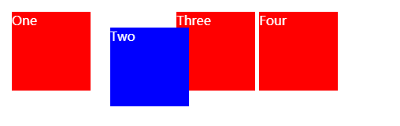
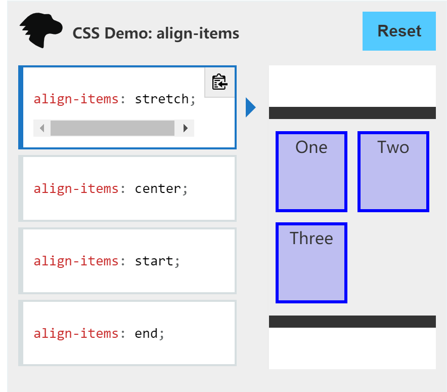

## Form Validator (Intro Project)

Simple client side form validation. Check required, length, email and password match

## Project Specifications

- Create form UI
- Show error messages under specific inputs
- checkRequired() to accept array of inputs
- checkLength() to check min and max length
- checkEmail() to validate email with regex
- checkPasswordsMatch() to match confirm password

## css
### vh(view height)
```css
body{
	min-height: 100vh;
}
```
>A percentage of the full viewport height. 10vh will resolve to 10% of the current viewport height.

+ 使用意义
使用 viewport height 的好處是讓我們能夠輕鬆達到響應式的設計，在不同裝置的瀏覽器內都能夠得到ㄧ致地效果

>
min-height 能够设置元素的最小高度。这样能够防止 height 属性的应用值小于 min-height 的值
当 min-height 大于 max-height 或 height 时，元素的高度会设置为 min-height 的值。

### \*{} box-sizing
>
\*{}代表的是所有HTML的doc元素标签
box-sizing 属性定义了 user agent 应该如何计算一个元素的总宽度和总高度

在 CSS 盒子模型的默认定义里，你对一个元素所设置的 width 与 height 只会应用到这个元素的内容区。如果这个元素有任何的 border 或 padding ，绘制到屏幕上时的盒子宽度和高度会加上设置的边框和内边距值。这意味着当你调整一个元素的宽度和高度时需要时刻注意到这个元素的边框和内边距。当我们实现响应式布局时，这个特点尤其烦人。

+ box-sizing:border-box
border-box 告诉浏览器：你想要设置的边框和内边距的值是包含在width内的。也就是说，如果你将一个元素的width设为100px，那么这100px会包含它的border和padding，内容区的实际宽度是width减去(border + padding)的值。大多数情况下，这使得我们更容易地设定一个元素的宽高

### :root{}
+ 定义
:root 这个 CSS 伪类匹配文档树的根元素。对于 HTML 来说，:root 表示 <html> 元素，除了优先级更高之外，与 html 选择器相同

+ 用途
在声明全局 CSS 变量时 :root 会很有用

+ example
```css
:root{
	--success-color:#2ecc71;
	--error-color:#e74c3c;
}


.form-control.success input {
  border-color: var(--success-color);
}

.form-control.error input {
  border-color: var(--error-color);
}
```

### position:relative
当一个元素的position属性设置为relative，它将使用相对定位。 相对定位的元素在普通流中进行定位，它将出现在文档流中原本的位置。 然而，可以通过设置水平或垂直偏移量，使它相对于原本的位置，偏移指定的距离，移动到新的位置。position:relative 对 table-*-group, table-row, table-column, table-cell, table-caption 元素无效。
```css
.box {
  display: inline-block;
  width: 100px;
  height: 100px;
  background: red;
  color: white;
}

#two {
  position: relative;
  top: 20px;
  left: 20px;
  background: blue;
}
```


### visibility:hidden
元素框是不可见的（未绘制），但仍会正常影响布局。如果他们的元素的后代将是可见的visibility设置visible。元素无法获得焦点（例如，在选项卡索引中导航时）。

### cursor
cursor CSS 属性设置光标的类型（如果有），在鼠标指针悬停在元素上时显示相应样式。
pointer:悬浮于连接上时，通常为手

### display
[display:inline、display:block、display:inline-block三者真实用途及含义是什么？](https://blog.csdn.net/sinat_34719507/article/details/53512509)
display:block就是将元素显示为块级元素。
>
block元素的特点是：
总是在新行上开始；
高度，行高以及顶和底边距都可控制；
宽度缺省是它的容器的100%，除非设定一个宽度
<div>, <p>, <h1>, <form>, <ul> 和 <li>是块元素的例子。

### align-items
>CSS align-items属性将所有直接子节点上的align-self值设置为一个组。 align-self属性设置项目在其包含块中在交叉轴方向上的对齐方式。



### justify-content
>CSS justify-content 属性定义了浏览器之间，如何分配顺着弹性容器主轴(或者网格行轴) 的元素之间及其周围的空间。与flex布局方式相关
```css
/* Positional alignment */
justify-content: center;     /* 居中排列 */
justify-content: start;      /* Pack items from the start */
justify-content: end;        /* Pack items from the end */
justify-content: flex-start; /* 从行首起始位置开始排列 */
justify-content: flex-end;   /* 从行尾位置开始排列 */
justify-content: left;       /* Pack items from the left */
justify-content: right;      /* Pack items from the right */
```
center：

### box-shadow
```css
/* x偏移量 | y偏移量 | 阴影颜色 */
box-shadow: 60px -16px teal;

/* x偏移量 | y偏移量 | 阴影模糊半径 | 阴影颜色 */
box-shadow: 10px 5px 5px black;

/* x偏移量 | y偏移量 | 阴影模糊半径 | 阴影扩散半径 | 阴影颜色 */
box-shadow: 2px 2px 2px 1px rgba(0, 0, 0, 0.2);

/* 插页(阴影向内) | x偏移量 | y偏移量 | 阴影颜色 */
box-shadow: inset 5em 1em gold;

/* 任意数量的阴影，以逗号分隔 */
box-shadow: 3px 3px red, -1em 0 0.4em olive;

/* 全局关键字 */
box-shadow: inherit;
box-shadow: initial;
box-shadow: unset;
```

### margin
外边距
```css
/* 应用于所有边 */
margin: 1em;
margin: -3px;

/* 上边下边 | 左边右边 */
margin: 5% auto;

/* 上边 | 左边右边 | 下边 */
margin: 1em auto 2em;

/* 上边 | 右边 | 下边 | 左边 */
margin: 2px 1em 0 auto;

/* 全局值 */
margin: inherit;
margin: initial;
margin: unset;
```

### padding
内边距
```css
/* 应用于所有边 */
padding: 1em;

/* 上边下边 | 左边右边 */
padding: 5% 10%;

/* 上边 | 左边右边 | 下边 */
padding: 1em 2em 2em;

/* 上边 | 右边 | 下边 | 左边 */
padding: 5px 1em 0 2em;

/* 全局值 */
padding: inherit;
padding: initial;
padding: unset;
```
### cursor
cursor CSS 属性设置光标的类型（如果有），在鼠标指针悬停在元素上时显示相应样式。

### outline
>CSS 的 outline 属性是在一条声明中设置多个轮廓属性的简写属性 ， 例如 outline-style, outline-width 和 outline-color。 

outline不占据空间，绘制于元素内容周围。
根据规范，outline通常是矩形，但也可以是非矩形的。

### css定义有空格的类名
```
.a.b{
color:red
}
<div class="a b">try me</div>
```

## html
### http-equiv="X-UA-Compatible"
与content="IE=edge"相匹配

### small标签
>
<small> 标签呈现小号字体效果。
<small> 标签和它所对应的 <big> 标签一样，但它是缩小字体而不是放大。如果被包围的字体已经是字体模型所支持的最小字号，那么 <small> 标签将不起任何作用。
与 <big> 标签类似，<small> 标签也可以嵌套，从而连续地把文字缩小。每个 <small> 标签都把文本的字体变小一号，直到达到下限的一号字。

## js
### .querySelector()
querySelector() 方法返回文档中匹配指定 CSS 选择器的一个元素

### .test()
test() 方法执行一个检索，用来查看正则表达式与指定的字符串是否匹配。返回 true 或 false。

### .charAt()
charAt() 方法从一个字符串中返回指定的字符。

### .slice()
slice() 方法返回一个新的数组对象，这一对象是一个由 begin 和 end 决定的原数组的浅拷贝（包括 begin，不包括end）。原始数组不会被改变。

+ example
```js
const animals = ['ant', 'bison', 'camel', 'duck', 'elephant'];

console.log(animals.slice(2));
// expected output: Array ["camel", "duck", "elephant"]

console.log(animals.slice(2, 4));
// expected output: Array ["camel", "duck"]

console.log(animals.slice(1, 5));
// expected output: Array ["bison", "camel", "duck", "elephant"]
```

### .preventDefault()
Event 接口的 preventDefault()方法，告诉user agent：如果此事件没有被显式处理，它默认的动作也不应该照常执行。此事件还是继续传播，除非碰到事件侦听器调用stopPropagation() 或stopImmediatePropagation()，才停止传播。

### forEach()
```js
const array1 = ['a', 'b', 'c'];

array1.forEach(element => console.log(element));

// expected output: "a"
// expected output: "b"
// expected output: "c"
```


