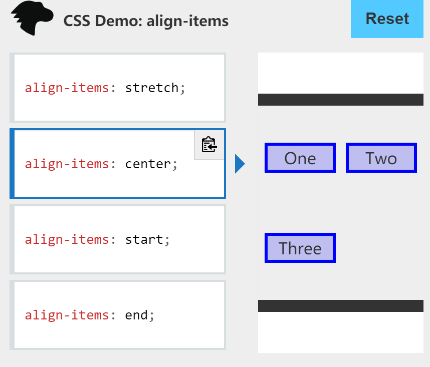
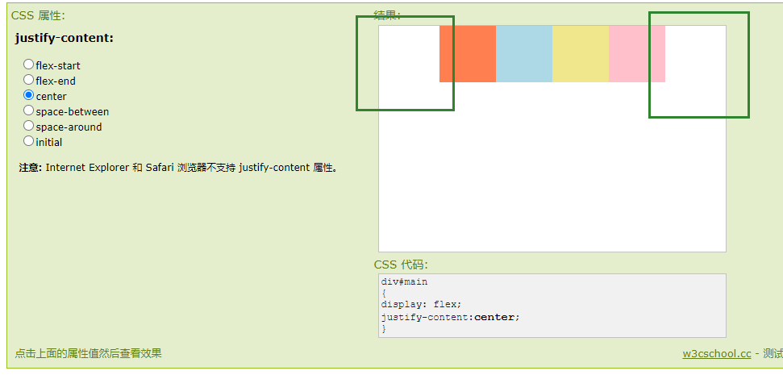
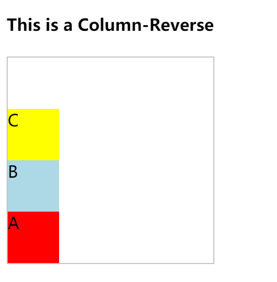
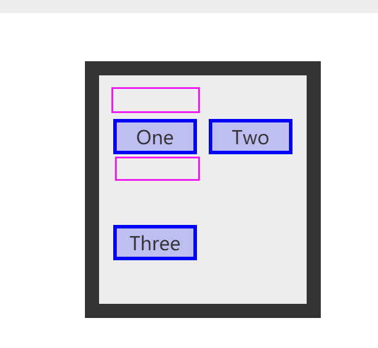
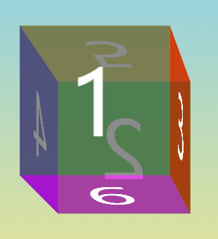

---

[TOC]

---

# Form Validator (Intro Project)

Simple client side form validation. Check required, length, email and password match

## Project Specifications

- Create form UI
- Show error messages under specific inputs
- checkRequired() to accept array of inputs
- checkLength() to check min and max length
- checkEmail() to validate email with regex
- checkPasswordsMatch() to match confirm password

## css
### vh(view height)
```css
body{
	min-height: 100vh;
}
```
>A percentage of the full viewport height. 10vh will resolve to 10% of the current viewport height.

+ 使用意义
使用 viewport height 的好處是讓我們能夠輕鬆達到響應式的設計，在不同裝置的瀏覽器內都能夠得到ㄧ致地效果

>
min-height 能够设置元素的最小高度。这样能够防止 height 属性的应用值小于 min-height 的值
当 min-height 大于 max-height 或 height 时，元素的高度会设置为 min-height 的值。

### \*{} box-sizing
>
\*{}代表的是所有HTML的doc元素标签
box-sizing 属性定义了 user agent 应该如何计算一个元素的总宽度和总高度

在 CSS 盒子模型的默认定义里，你对一个元素所设置的 width 与 height 只会应用到这个元素的内容区。如果这个元素有任何的 border 或 padding ，绘制到屏幕上时的盒子宽度和高度会加上设置的边框和内边距值。这意味着当你调整一个元素的宽度和高度时需要时刻注意到这个元素的边框和内边距。当我们实现响应式布局时，这个特点尤其烦人。

+ box-sizing:border-box
border-box 告诉浏览器：你想要设置的边框和内边距的值是包含在width内的。也就是说，如果你将一个元素的width设为100px，那么这100px会包含它的border和padding，内容区的实际宽度是width减去(border + padding)的值。大多数情况下，这使得我们更容易地设定一个元素的宽高

### :root{}
+ 定义
:root 这个 CSS 伪类匹配文档树的根元素。对于 HTML 来说，:root 表示 <html> 元素，除了优先级更高之外，与 html 选择器相同

+ 用途
在声明全局 CSS 变量时 :root 会很有用

+ example
```css
:root{
	--success-color:#2ecc71;
	--error-color:#e74c3c;
}


.form-control.success input {
  border-color: var(--success-color);
}

.form-control.error input {
  border-color: var(--error-color);
}
```

### position:relative
当一个元素的position属性设置为relative，它将使用相对定位。 相对定位的元素在普通流中进行定位，它将出现在文档流中原本的位置。 然而，可以通过设置水平或垂直偏移量，使它相对于原本的位置，偏移指定的距离，移动到新的位置。position:relative 对 table-\*-group, table-row, table-column, table-cell, table-caption 元素无效。

```css
.box {
  display: inline-block;
  width: 100px;
  height: 100px;
  background: red;
  color: white;
}

#two {
  position: relative;
  top: 20px;
  left: 20px;
  background: blue;
}
```


### visibility:hidden
元素框是不可见的（未绘制），但仍会正常影响布局。如果他们的元素的后代将是可见的visibility设置visible。元素无法获得焦点（例如，在选项卡索引中导航时）。

### cursor
cursor CSS 属性设置光标的类型（如果有），在鼠标指针悬停在元素上时显示相应样式。
pointer:悬浮于连接上时，通常为手

### display
[display:inline、display:block、display:inline-block三者真实用途及含义是什么？](https://blog.csdn.net/sinat_34719507/article/details/53512509)
display:block就是将元素显示为块级元素。
>
block元素的特点是：
总是在新行上开始；
高度，行高以及顶和底边距都可控制；
宽度缺省是它的容器的100%，除非设定一个宽度
<div>, <p>, <h1>, <form>, <ul> 和 <li>是块元素的例子。

### align-items
>CSS align-items属性将所有直接子节点上的align-self值设置为一个组。 align-self属性设置项目在其包含块中在交叉轴方向上的对齐方式。



### justify-content
>CSS justify-content 属性定义了浏览器之间，如何分配顺着弹性容器主轴(或者网格行轴) 的元素之间及其周围的空间。与flex布局方式相关
```css
/* Positional alignment */
justify-content: center;     /* 居中排列 */
justify-content: start;      /* Pack items from the start */
justify-content: end;        /* Pack items from the end */
justify-content: flex-start; /* 从行首起始位置开始排列 */
justify-content: flex-end;   /* 从行尾位置开始排列 */
justify-content: left;       /* Pack items from the left */
justify-content: right;      /* Pack items from the right */
```
center：

### box-shadow
```css
/* x偏移量 | y偏移量 | 阴影颜色 */
box-shadow: 60px -16px teal;

/* x偏移量 | y偏移量 | 阴影模糊半径 | 阴影颜色 */
box-shadow: 10px 5px 5px black;

/* x偏移量 | y偏移量 | 阴影模糊半径 | 阴影扩散半径 | 阴影颜色 */
box-shadow: 2px 2px 2px 1px rgba(0, 0, 0, 0.2);

/* 插页(阴影向内) | x偏移量 | y偏移量 | 阴影颜色 */
box-shadow: inset 5em 1em gold;

/* 任意数量的阴影，以逗号分隔 */
box-shadow: 3px 3px red, -1em 0 0.4em olive;

/* 全局关键字 */
box-shadow: inherit;
box-shadow: initial;
box-shadow: unset;
```

### margin
外边距
```css
/* 应用于所有边 */
margin: 1em;
margin: -3px;

/* 上边下边 | 左边右边 */
margin: 5% auto;

/* 上边 | 左边右边 | 下边 */
margin: 1em auto 2em;

/* 上边 | 右边 | 下边 | 左边 */
margin: 2px 1em 0 auto;

/* 全局值 */
margin: inherit;
margin: initial;
margin: unset;
```

### padding
内边距
```css
/* 应用于所有边 */
padding: 1em;

/* 上边下边 | 左边右边 */
padding: 5% 10%;

/* 上边 | 左边右边 | 下边 */
padding: 1em 2em 2em;

/* 上边 | 右边 | 下边 | 左边 */
padding: 5px 1em 0 2em;

/* 全局值 */
padding: inherit;
padding: initial;
padding: unset;
```
### cursor
cursor CSS 属性设置光标的类型（如果有），在鼠标指针悬停在元素上时显示相应样式。

### outline
>CSS 的 outline 属性是在一条声明中设置多个轮廓属性的简写属性 ， 例如 outline-style, outline-width 和 outline-color。 

outline不占据空间，绘制于元素内容周围。
根据规范，outline通常是矩形，但也可以是非矩形的。

### css定义有空格的类名
```
.a.b{
color:red
}
<div class="a b">try me</div>
```

## html
### http-equiv="X-UA-Compatible"
与content="IE=edge"相匹配

### small标签
>
<small> 标签呈现小号字体效果。
<small> 标签和它所对应的 <big> 标签一样，但它是缩小字体而不是放大。如果被包围的字体已经是字体模型所支持的最小字号，那么 <small> 标签将不起任何作用。
与 <big> 标签类似，<small> 标签也可以嵌套，从而连续地把文字缩小。每个 <small> 标签都把文本的字体变小一号，直到达到下限的一号字。

## js
### .querySelector()
querySelector() 方法返回文档中匹配指定 CSS 选择器的一个元素

### .test()
test() 方法执行一个检索，用来查看正则表达式与指定的字符串是否匹配。返回 true 或 false。

### .charAt()
charAt() 方法从一个字符串中返回指定的字符。

### .slice()
slice() 方法返回一个新的数组对象，这一对象是一个由 begin 和 end 决定的原数组的浅拷贝（包括 begin，不包括end）。原始数组不会被改变。

+ example
```js
const animals = ['ant', 'bison', 'camel', 'duck', 'elephant'];

console.log(animals.slice(2));
// expected output: Array ["camel", "duck", "elephant"]

console.log(animals.slice(2, 4));
// expected output: Array ["camel", "duck"]

console.log(animals.slice(1, 5));
// expected output: Array ["bison", "camel", "duck", "elephant"]
```

### .preventDefault()
Event 接口的 preventDefault()方法，告诉user agent：如果此事件没有被显式处理，它默认的动作也不应该照常执行。此事件还是继续传播，除非碰到事件侦听器调用stopPropagation() 或stopImmediatePropagation()，才停止传播。

### forEach()
```js
const array1 = ['a', 'b', 'c'];

array1.forEach(element => console.log(element));

// expected output: "a"
// expected output: "b"
// expected output: "c"
```

# Movie Seat Booking

Display movie choices and seats in a theater to select from in order to purchase tickets

## Project Specifications

- Display UI with movie select, screen, seats, legend & seat info
- User can select a movie/price
- User can select/deselect seats
- User can not select occupied seats
- Number of seats and price will update
- Save seats, movie and price to local storage so that UI is still populated on refresh

Design inspiration from [Dribbble](https://dribbble.com/shots/3628370-Movie-Seat-Booking)

## html
### select标签
创建带有 4 个选项的选择列表：
```html
<select>
  <option value ="volvo">Volvo</option>
  <option value ="saab">Saab</option>
  <option value="opel">Opel</option>
  <option value="audi">Audi</option>
</select>
```

### ul
HTML `<ul>` 标签
实例
无序 HTML 列表：

```html
<ul>
  <li>Coffee</li>
  <li>Tea</li>
  <li>Milk</li>
</ul>
```

### span
HTML` <span> `标签
使用` <span> `元素对文本中的一部分进行着色：

```html
<p>我的母亲有 <span style="color:blue">蓝色</span> 的眼睛。</p>
```

## css
### flex-direction
前提是上边有display:flex
CSS flex-direction 属性指定了内部元素是如何在 flex 容器中布局的，定义了主轴的方向

`column`
flex容器的主轴和块轴相同。主轴起点与主轴终点和书写模式的前后点相同


### align-items
>
align-items属性将所有直接子节点上的align-self值设置为一个组。 align-self属性设置项目在其包含块中在交叉轴方向上的对齐方式。

Flexbox和CSS网格布局支持此属性。在Flexbox中，它控制十字轴上项目的对齐方式，在网格布局中，它控制块轴上项目的对齐方式。

center:

如图所示，因为是center，所以上方和下方留有空余

### justify-content
>
justify-content 属性定义了浏览器之间，如何分配顺着弹性容器主轴(或者网格行轴) 的元素之间及其周围的空间

`center`
伸缩元素向每行中点排列。每行第一个元素到行首的距离将与每行最后一个元素到行尾的距离相同。

`space-between`
均匀排列每个元素
首个元素放置于起点，末尾元素放置于终点

### margin
外边距
```
/* 应用于所有边 */
margin: 1em;
margin: -3px;

/* 上边下边 | 左边右边 */
margin: 5% auto;

/* 上边 | 左边右边 | 下边 */
margin: 1em auto 2em;

/* 上边 | 右边 | 下边 | 左边 */
margin: 2px 1em 0 auto;
```
### padding
内边距

### -moz-appearance -webkit-appearance
css3特性

为了去除系统默认appearance的样式引发的问题?

在基于 Gecko 的浏览器（如 Firefox）中，-moz-appearance CSS 属性被用于按照 浏览器所在的操作系统所用主题，以平台本地的样式显示元素。

在基于 WebKit 的浏览器（如 Safari）和基于 Blink 的浏览器（如 Chrome, Opera）中，-webkit-appearance 属性被用于达到相同 to achieve the same thing. Note that Edge also supports -webkit-appearance (instead of -ms-appearance) for compatibility reasons.

>
The appearance property is used to display an element using a platform-native styling based on the users’ operating system’s theme.

### perspective
CSS 属性 perspective指定了观察者与 z=0 平面的距离，使具有三维位置变换的元素产生透视效果。 z>0 的三维元素比正常大，而 z<0 时则比正常小，大小程度由该属性的值决定

none


800px


### border-top-left/right-radius

### border
默认的border可能有一定的宽度，所以有的时候要设置成0

### class中有空格
比如class="s s"
css中定义为.s.s{}

### nth-of-type(2)
:nth-of-type() 这个 CSS 伪类是针对具有一组兄弟节点的标签, 用 n 来筛选出在一组兄弟节点的位置。

+ example
```css
/* 在每组兄弟元素中选择第四个 <p> 元素 */
p:nth-of-type(4n) {
  color: lime;
}
```

```css
.seat:nth-of-type(2){
	margin-right:18px;
}
```
对于每一个div下的div class="seat"的第二个div做右外边距调整

### :nth-last-of-type
:nth-last-of-type(an+b) 这个 CSS 伪类 匹配那些在它之后有 an+b-1 个相同类型兄弟节点的元素，其中 n 为正值或零值。它基本上和 :nth-of-type 一样，只是它从结尾处反序计数，而不是从开头处。

### hover
>
:hover CSS伪类适用于用户使用指示设备虚指一个元素（没有激活它）的情况。这个样式会被任何与链接相关的伪类重写，像:link, :visited, 和 :active等。为了确保生效，:hover规则需要放在:link和:visited规则之后，但是在:active规则之前，按照LVHA的循顺序声明:link－:visited－:hover－:active。
:hover伪类可以任何伪元素上使用。
用户的可视客户端比如Firefox, Internet Explorer, Safari, Opera or Chrome

添加后可应用transform

### transform
>transform属性允许你旋转，缩放，倾斜或平移给定元素。这是通过修改CSS视觉格式化模型的坐标空间来实现的

transform: scale(1.2);
放大1.2倍

transform: rotateX(-45deg);
rotationX（）CSS函数定义了一个变换，该变换绕着横坐标（水平轴）旋转元素而不会变形

### not
.seat:not(.occupied):hover

已知html里有`seat` `seat occpuied`两个class

### rgba
RGBA 即红色、绿色、蓝色、透明度（英语：Red, Green, Blue、Alpha）

### list-style-type


### box-shadow
```
/* x偏移量 | y偏移量 | 阴影颜色 */
box-shadow: 60px -16px teal;

/* x偏移量 | y偏移量 | 阴影模糊半径 | 阴影颜色 */
box-shadow: 10px 5px 5px black;

/* x偏移量 | y偏移量 | 阴影模糊半径 | 阴影扩散半径 | 阴影颜色 */
box-shadow: 2px 2px 2px 1px rgba(0, 0, 0, 0.2);

/* 插页(阴影向内) | x偏移量 | y偏移量 | 阴影颜色 */
box-shadow: inset 5em 1em gold;

/* 任意数量的阴影，以逗号分隔 */
box-shadow: 3px 3px red, -1em 0 0.4em olive;
```

### flex
http://www.ruanyifeng.com/blog/2015/07/flex-grammar.html


>容器默认存在两根轴：水平的主轴（main axis）和垂直的交叉轴（cross axis）。主轴的开始位置（与边框的交叉点）叫做main start，结束位置叫做main end；交叉轴的开始位置叫做cross start，结束位置叫做cross end。

项目默认沿主轴排列。单个项目占据的主轴空间叫做main size，占据的交叉轴空间叫做cross size。

以下6个属性设置在容器上。
```
flex-direction
flex-wrap
flex-flow
justify-content
align-items
align-content
```

justify-content属性定义了项目在主轴上的对齐方式。
```css
.box {
  justify-content: flex-start | flex-end | center | space-between | space-around;
}
```


flex-start（默认值）：左对齐
flex-end：右对齐
center： 居中
space-between：两端对齐，项目之间的间隔都相等。
space-around：每个项目两侧的间隔相等。所以，项目之间的间隔比项目与边框的间隔大一倍。

## js
### .querySelectorAll()
返回与指定的选择器组匹配的文档中的元素列表 (使用深度优先的先序遍历文档的节点)。返回的对象是 NodeList 。
querySelector
返回指定元素节点的子树中匹配selector的集合中的第一个

### 变量前加'+'
把后面的内容转成 number 类型

### localstorage
只读的localStorage 属性允许你访问一个Document 源（origin）的对象 Storage；存储的数据将保存在浏览器会话中。localStorage 类似 sessionStorage，但其区别在于：存储在 localStorage 的数据可以长期保留；而当页面会话结束——也就是说，当页面被关闭时，存储在 sessionStorage 的数据会被清除 。

应注意，无论数据存储在 localStorage 还是 sessionStorage ，它们都特定于页面的协议。

另外，localStorage 中的键值对总是以字符串的形式存储。 (需要注意, 和js对象相比, 键值对总是以字符串的形式存储意味着数值类型会自动转化为字符串类型).

### es6（...）这三个点在JavaScript中意味着什么？
https://segmentfault.com/a/1190000016168214
array/object  
也叫做rest运算符,...nums,那么nums还拥有之前所定义的属性,但是在后面我们也可以传递新值来覆盖原本属性，我觉得类似于继承
如果用于数组，只能在末尾添加
```js
const num1=[1,2,3];
const num2=[...num1,1,2,3];//this will be [1,2,3,1,2,3]
```
### map
map() 方法创建一个新数组，其结果是该数组中的每个元素是调用一次提供的函数后的返回值。

### 箭头函数
```js
var elements = [
  'Hydrogen',
  'Helium',
  'Lithium',
  'Beryllium'
];

elements.map(function(element) { 
  return element.length; 
}); // 返回数组：[8, 6, 7, 9]

// 上面的普通函数可以改写成如下的箭头函数
elements.map((element) => {
  return element.length;
}); // [8, 6, 7, 9]


x => x * x;
function (x) {
    return x * x;
}
```

### indexOf()
indexOf()方法返回在数组中可以找到一个给定元素的第一个索引，如果不存在，则返回-1。

### JSON.stringify
JSON.stringify() 方法将一个 JavaScript 对象或值转换为 JSON 字符串，如果指定了一个 replacer 函数，则可以选择性地替换值，或者指定的 replacer 是数组，则可选择性地仅包含数组指定的属性。
 存储前先用JSON.stringify()方法将json对象转换成json字符串形式；
 localStorage 的存储格式都是字符串，任何其他类型都要转成字符串存储。

### JSON.parse
JSON.parse() 方法用来解析JSON字符串，构造由字符串描述的JavaScript值或对象。提供可选的 reviver 函数用以在返回之前对所得到的对象执行变换(操作)。

### forEach
>
forEach() 方法对数组的每个元素执行一次给定的函数。

```js
const array1 = ['a', 'b', 'c'];

array1.forEach(element => console.log(element));

// expected output: "a"
// expected output: "b"
// expected output: "c"
```

### classList
Element.classList 是一个只读属性，返回一个元素的类属性的实时 DOMTokenList 集合。

相比将 element.className 作为以空格分隔的字符串来使用，classList 是一种更方便的访问元素的类列表的方法。

### .addEventListener
EventTarget.addEventListener() 方法将指定的监听器注册到 EventTarget 上，当该对象触发指定的事件时，指定的回调函数就会被执行。 事件目标可以是一个文档上的元素 Element,Document和Window或者任何其他支持事件的对象 (比如 XMLHttpRequest)。

addEventListener()的工作原理是将实现EventListener的函数或对象添加到调用它的EventTarget上的指定事件类型的事件侦听器列表中。

### Event.target
触发事件的对象 (某个DOM元素) 的引用。当事件处理程序在事件的冒泡或捕获阶段被调用时，

### toggle(visible)
如果 visible 类值已存在，则移除它，否则添加它


# Custom Video Player

Custom video player using the HTML5 video element and it's JavaScript API with a custom design

## Project Specifications

- Display custom video player styled with CSS
- Play/pause
- Stop
- Video progress bar
- Set progress bar time
- Display time in mins and seconds

## HTML
### link-integrity&crossorigin

两个属性一般在获取外部资源时使用

```html
<link href="https://maxcdn.bootstrapcdn.com/bootstrap/3.3.5/css/bootstrap.min.css" 
rel="stylesheet" 
integrity="sha256-MfvZlkHCEqatNoGiOXveE8FIwMzZg4W85qfrfIFBfYc= sha512-dTfge/zgoMYpP7QbHy4gWMEGsbsdZeCXz7irItjcC3sPUFtf0kuFbDz/ixG7ArTxmDjLXDmezHubeNikyKGVyQ==" 
crossorigin="anonymous">
```

integrity:
子资源完整性 (SRI) 是一项安全功能，可让浏览器验证其抓取的文件 (例如，从一个 CDN) 是在没有意外操作的情况下传递的。它的工作原理是允许您提供一个获取的文件必须匹配的加密散列/哈希。
允许浏览器检查文件源，以确保如果源已被操纵，则从不加载代码。

crossorigin:
该枚举属性指定在加载相关图片时是否必须使用CORS。可取的值包括以下两个：
- anonymous：会发起一个跨域请求（即包含Origin: HTTP头）。但不会发送任何认证信息（即不发送cookie, X.509证书和HTTP基本认证信息）。如果服务器没有给出源站凭证（不设置Access-Control-Allow-Origin: HTTP头），这张图片就会被污染并限制使用。
- use-credentials：会发起一个带有认证信息 (发送 cookie, X.509 证书和 HTTP 基本认证信息) 的跨域请求 (即包含 Origin: HTTP 头). 如果服务器没有给出源站凭证 (不设置 Access-Control-Allow-Origin: HTTP 头), 这张图片就会被污染并限制使用.
- 当不设置该属性时, 资源将会不使用 CORS 加载 (即不发送 Origin: HTTP 头), 这将阻止其在 元素中进行使用. 若设置了非法的值, 则视为使用 anonymous.

### video

```html
    <video
      src="videos/gone.mp4"
      id="video"
      class="screen"
      poster="img/poster.png"
    ></video>
```

### i
`<i>` 标签显示斜体文本效果。

### input-type:range
`<input type =“ range”>`定义了一个控件，用于输入其确切值不重要的数字（如滑块控件）。 默认范围是0到100。但是，您可以使用min，max和step属性设置对可接受的数字的限制

```html
<form>
  <label for="vol">Volume (between 0 and 50):</label>
  <input type="range" id="vol" name="vol" min="0" max="50">
</form>
```


## CSS
### flex-direction
column-reverse:


### important
当在一个样式声明中使用一个 !important 规则时，此声明将覆盖任何其他声明。虽然，从技术上讲，!important 与优先级无关，但它与最终的结果直接相关。使用 !important 是一个坏习惯，应该尽量避免，因为这破坏了样式表中的固有的级联规则 使得调试找bug变得更加困难了。当两条相互冲突的带有 !important 规则的声明被应用到相同的元素上时，拥有更大优先级的声明将会被采用。

+ 一定要优先考虑使用样式规则的优先级来解决问题而不是 !important
+ 只有在需要覆盖全站或外部 CSS 的特定页面中使用 !important
+ 永远不要在你的插件中使用 !important
+ 永远不要在全站范围的 CSS 代码中使用 !important

### background:transparent
背景透明

### @media
>@media CSS @规则 可用于基于一个或多个 媒体查询 的结果来应用样式表的一部分。 使用它，您可以指定一个媒体查询和一个CSS块，当且仅当该媒体查询与正在使用其内容的设备匹配时，该CSS块才能应用于该文档。


### input[type="range"] 浏览器兼容
https://css-tricks.com/styling-cross-browser-compatible-range-inputs-css/
需要在所有浏览器中将几种样式应用于范围输入，以覆盖其基本外观
```css
input[type=range] {
  -webkit-appearance: none; /* Hides the slider so that custom slider can be made */
  width: 100%; /* Specific width is required for Firefox. */
  background: transparent; /* Otherwise white in Chrome */
}

input[type=range]::-webkit-slider-thumb {
  -webkit-appearance: none;
}

input[type=range]:focus {
  outline: none; /* Removes the blue border. You should probably do some kind of focus styling for accessibility reasons though. */
}

input[type=range]::-ms-track {
  width: 100%;
  cursor: pointer;

  /* Hides the slider so custom styles can be added */
  background: transparent; 
  border-color: transparent;
  color: transparent;
}
```
这在所有浏览器中为我们提供了不可见或未设置样式的范围输入。现在，我们可以应用自定义样式。

### ::-webkit-slider-thumb
https://developer.mozilla.org/zh-CN/docs/Web/CSS/::-webkit-slider-thumb

这是type为range的input标签内的一种伪类样式,用于设置range的滑块的具体样式,该伪类只在内核为webkit/blink的浏览器中有效
该伪类需要配和::-webkit-slider-runnable-track使用,否则会没有效果
```css
input[type=range]::-webkit-slider-thumb{
    -webkit-appearance: none;/*清除默认样式*/
    height:7vw;/*设置滑块高度*/
    width:5vw;/*设置滑块宽度*/
    background:#000;/*设置背景色*/
    border-radius:10vw 10vw;/*加个圆角边*/
    margin-top:-1vw;/*使用position的话会导致滑块不滑动,但是绑定的value是改变的,所以这里使用margin-top去做定位*/
}
input[type=range]::-webkit-slider-runnable-track{
    border-radius: 30px; 
    background:#128;
    height:15px;
}
```

### ::-ms-track
非标准
此功能是非标准的，不在标准范围内。不要在面向Web的生产站点上使用它：它不适用于每个用户。实现之间也可能存在很大的不兼容性，并且将来的行为可能会更改。

在::-ms-trackCSS伪元素是微软扩展，代表一个滑块控件的轨道。滑块控件是`<input type =“ range”>`的一种可能表示形式。

### ::-ms-fill-lower
的CSS伪元素表示的滑块控制的轨道的下部; 即，对应于小于拇指当前选择的值的值的部分。滑块控件是<input type =“ range”>的一种可能表示形式。::-ms-fill-lower

## JS
### video相关操作
相关事件:https://developer.mozilla.org/zh-CN/docs/Web/Guide/Events/Media_events
video.paused
video.play()
video.pause()
video.currentTime 
video.duration 总长度

### Math.floor
向下取整

# Exchange Rate

Select countries to get the exchange rate for a specific amount

## Project Specifications

- Display UI with 2 select lists for countries and 2 inputs for amounts
- Fetch exchange rates from API (https://api.exchangerate-api.com)
- Display the values for both countries
- Update values on amount change
- Swap country rates

## html
### img-alt
alt:alt 属性是一个必需的属性，它规定在图像无法显示时的替代文本
### input-value
预定义

## css
### background-image
url('')
### background-position
```css
/* Keyword values */
background-position: top;
background-position: bottom;
background-position: left;
background-position: right;
background-position: center;

/* <percentage> values */
background-position: 25% 75%;

/* <length> values */
background-position: 0 0;
background-position: 1cm 2cm;
background-position: 10ch 8em;

/* Multiple images */
background-position: 0 0, center;

/* Edge offsets values */
background-position: bottom 10px right 20px;
background-position: right 3em bottom 10px;
background-position: bottom 10px right;
background-position: top right 10px;

/* Global values */
background-position: inherit;
background-position: initial;
background-position: unset;
```
### background-size
```css
/* 关键字 */
background-size: cover
background-size: contain

/* 一个值: 这个值指定图片的宽度，图片的高度隐式的为auto */
background-size: 50%
background-size: 3em
background-size: 12px
background-size: auto

/* 两个值 */
/* 第一个值指定图片的宽度，第二个值指定图片的高度 */
background-size: 50% auto
background-size: 3em 25%
background-size: auto 6px
background-size: auto auto

/* 逗号分隔的多个值：设置多重背景 */
background-size: auto, auto     /* 不同于background-size: auto auto */
background-size: 50%, 25%, 25%
background-size: 6px, auto, contain

/* 全局属性 */
background-size: inherit;
background-size: initial;
background-size: unset;
```
### background-repeat
 background-repeat CSS 属性定义背景图像的重复方式。背景图像可以沿着水平轴，垂直轴，两个轴重复，或者根本不重复。

```
 /* 单值语法 */
background-repeat: repeat-x;
background-repeat: repeat-y;
background-repeat: repeat;
background-repeat: space;
background-repeat: round;
background-repeat: no-repeat;

/* 双值语法: 水平horizontal | 垂直vertical */
background-repeat: repeat space;
background-repeat: repeat repeat;
background-repeat: round space;
background-repeat: no-repeat round;

background-repeat: inherit;
```
## js
### fetch()
https://developer.mozilla.org/zh-CN/docs/Web/API/Fetch_API/Using_Fetch

>Fetch API 提供了一个 JavaScript 接口，用于访问和操纵 HTTP 管道的一些具体部分，例如请求和响应。它还提供了一个全局 fetch() 方法，该方法提供了一种简单，合理的方式来跨网络异步获取资源。

```js
fetch('http://example.com/movies.json')
  .then(function(response) {
    return response.json();
  })
  .then(function(myJson) {
    console.log(myJson);
  });
```
这里我们通过网络获取一个 JSON 文件并将其打印到控制台。最简单的用法是只提供一个参数用来指明想 fetch() 到的资源路径，然后返回一个包含响应结果的promise（一个 Response 对象）。

当然它只是一个 HTTP 响应，而不是真的JSON。为了获取JSON的内容，我们需要使用 json() 方法（在 Body mixin 中定义，被 Request 和 Response 对象实现）。
```js
  fetch(`https://api.exchangerate-api.com/v4/latest/${currency_one}`)
    .then(res => res.json())
    .then(data => {
      // console.log(data);
      const rate = data.rates[currency_two];

      rateEl.innerText = `1 ${currency_one} = ${rate} ${currency_two}`;

      amountEl_two.value = (amountEl_one.value * rate).toFixed(2);
    });
```
### .toFixed()
toFixed() 方法使用定点表示法来格式化一个数值。
小数点后数字的个数；介于 0 到 20 （包括）之间，实现环境可能支持更大范围。如果忽略该参数，则默认为 0。